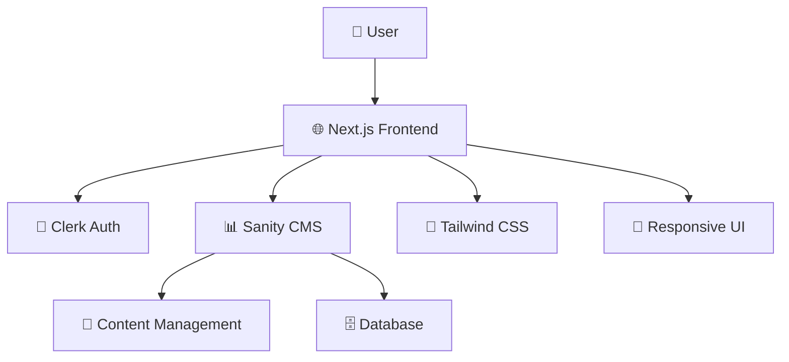

<div align="center">

# 🔧 Mitra Servis - Platform Servis Elektronika

### _Platform digital modern untuk layanan perbaikan elektronik dengan sistem manajemen pesanan terintegrasi_

<br>

<!-- Large Professional Illustration -->


<br><br>

### 🛠️ **Tech Stack**

<!-- Core Technologies -->


<!-- Backend & Auth -->


<!-- Tools & Deployment -->


<br>

<!-- Action Buttons with Gradient Colors -->

[](https://mitra-servis.vercel.app)
[](#-cara-menjalankan)
[](https://github.com/ifwhy/mitra-service-front-end-web)

</div>

---

## 📋 **Daftar Isi**

- [🎯 Tentang Proyek](#-tentang-proyek)
- [✨ Fitur Utama](#-fitur-utama)
- [👥 Tim Pengembang](#-tim-pengembang)
- [🏗️ Arsitektur](#️-arsitektur)
- [📁 Struktur Proyek](#-struktur-proyek)
- [🚀 Cara Menjalankan](#-cara-menjalankan)
- [🔧 Konfigurasi Environment](#-konfigurasi-environment)
- [🔗 Repository Links](#-repository-links)
- [📝 Catatan Pengembangan](#-catatan-pengembangan)
- [🤝 Kontribusi](#-kontribusi)
- [📄 License](#-license)

---

## 🎯 **Tentang Proyek**

**Mitra Service** adalah platform digital modern untuk layanan perbaikan elektronik yang memungkinkan pelanggan untuk:

- 🛠️ Memesan layanan perbaikan secara online
- 📊 Melacak status perbaikan real-time
- 💬 Berkomunikasi dengan teknisi
- 📸 Upload foto kondisi perangkat
- 🚚 Memilih opsi pickup atau delivery
- 💳 Manajemen pembayaran yang transparan

---

## ✨ **Fitur Utama**

<div align="center">

|     🔐 **Autentikasi**      | 📋 **Manajemen Pesanan**  |     🔍 **Tracking**     |
| :-------------------------: | :-----------------------: | :---------------------: |
| Login/Register dengan Clerk | Dashboard pesanan lengkap | Real-time status update |
|     Profile management      | Form pemesanan interaktif |   Timeline perbaikan    |
|      Role-based access      |    Upload foto kondisi    |   Notifikasi progress   |

|   📱 **Responsive**   |     🎨 **UI/UX**     | ⚡ **Performance** |
| :-------------------: | :------------------: | :----------------: |
|  Mobile-first design  | Modern glassmorphism |  Optimized images  |
| Cross-browser support |   Dark/Light mode    |  Fast page loads   |
|    Touch-friendly     |  Smooth animations   |   SEO optimized    |

</div>

---

## 👥 **Tim Pengembang**

<div align="center">

|       |    |       |
| :--------------------------------------------------------: | :------------------------------------------------------: | :------------------------------------------------: |
| **[Dunhill William Putra](https://github.com/williamu04)** | **[Fathoni Nur Habibi](https://github.com/Fathoni1509)** | **[Ivan Wahyu Nugroho](https://github.com/ifwhy)** |
|                       Backend & CMS                        |                     Frontend & UI/UX                     |               Frontend & Integration               |
|                   _Sanity Schema Design_                   |                 _Component Development_                  |                 _API Integration_                  |

</div>

---

## 🏗️ **Arsitektur**

<div align="center">



</div>

---

## 📁 **Struktur Proyek**

<div align="center">

### 🎨 Frontend (Next.js)

</div>

```
📦 frontend/
├── 🎯 app/
│   ├── 🏠 (root)/
│   │   ├── 📄 page.tsx              # Landing page
│   │   └── 🎨 layout.tsx            # Root layout
│   │
│   ├── 📊 dashboard/
│   │   ├── 📋 orders/[id]/
│   │   │   └── 📄 page.tsx          # Order detail page
│   │   ├── 📄 page.tsx              # Dashboard home
│   │   ├── ⏳ loading.tsx           # Loading state
│   │   └── 🎨 layout.tsx            # Dashboard layout
│   │
│   ├── 🎨 layout.tsx                # App layout
│   ├── ❌ not-found.tsx             # 404 page
│   └── ⏳ loading.tsx               # Global loading
│
├── 🧩 components/
│   ├── 📊 dashboard/
│   │   ├── 📋 OrdersTab.tsx         # Orders management
│   │   ├── ➕ NewOrderTab.tsx       # Create new order
│   │   ├── 🔔 NotificationsTab.tsx  # Notifications
│   │   └── 👤 ProfileTab.tsx        # User profile
│   │
│   ├── 🎨 ui/                       # Reusable UI components
│   └── 🏠 home/                     # Landing page components
│
├── 🔧 lib/
│   ├── 🗃️ sanity-utils.ts          # Sanity utilities
│   ├── 🔍 queries.ts               # GROQ queries
│   └── ⚙️ utils.ts                 # Helper functions
│
├── 📱 sanity/
│   └── 🔗 client.ts                # Sanity client config
│
├── 🖼️ public/
│   └── 📸 images/                   # Static assets
│
└── 🔐 .env                         # Environment variables
```

<div align="center">

### 🗄️ Backend (Sanity CMS)

</div>

```
📦 backend/
├── 📋 schemaTypes/
│   ├── 🧩 objects/
│   │   ├── 📝 note.ts               # Repair notes
│   │   ├── 🖼️ repairImage.ts        # Image uploads
│   │   ├── 🔧 repairService.ts      # Service details
│   │   ├── ⏰ timelineEvent.ts      # Progress timeline
│   │   ├── 🛡️ warranty.ts          # Warranty info
│   │   └── 💰 pricing.ts           # Pricing structure
│   │
│   ├── 👤 customer.ts               # Customer schema
│   ├── 🔧 repair.ts                 # Repair order schema
│   ├── ⭐ review.ts                 # Review schema
│   ├── 🛠️ technician.ts            # Technician schema
│   ├── 🚚 pickup.ts                 # Pickup service schema
│   ├── 💳 payment.ts               # Payment schema
│   └── 📄 index.ts                 # Schema exports
│
├── ⚙️ sanity.config.ts              # Sanity configuration
├── 🔐 sanity.cli.ts                # CLI configuration
└── 🔒 .env                         # Environment variables
```

---

## 🚀 **Cara Menjalankan**

### 📋 Prerequisites

- **Node.js** 18.0 atau lebih tinggi
- **npm** atau **yarn** package manager
- **Git** version control

### 🎨 Frontend Setup

```bash
# 1️⃣ Clone repository
git clone https://github.com/ifwhy/mitra-service-front-end-web.git
cd mitra-service-front-end-web

# 2️⃣ Install dependencies
npm install
# atau
yarn install

# 3️⃣ Setup environment variables
cp .env.example .env.local
# Edit .env.local dengan konfigurasi Anda

# 4️⃣ Jalankan development server
npm run dev
# atau
yarn dev

# 🌐 Buka browser: http://localhost:3000
```

### 🗄️ Backend Setup (Sanity CMS)

```bash
# 1️⃣ Clone repository
git clone https://github.com/williamu04/mitra-service-backend.git
cd mitra-service-backend

# 2️⃣ Install Sanity CLI (global)
npm install -g @sanity/cli

# 3️⃣ Install dependencies
npm install

# 4️⃣ Login ke Sanity
sanity login

# 5️⃣ Deploy schema
sanity deploy

# 6️⃣ Jalankan Sanity Studio (opsional)
sanity dev

# 🌐 Studio tersedia di: http://localhost:3333
```

---

## 🔧 **Konfigurasi Environment**

### Frontend (.env.local)

```bash
# 🔐 Clerk Authentication
NEXT_PUBLIC_CLERK_PUBLISHABLE_KEY=pk_test_xxxxx
CLERK_SECRET_KEY=sk_test_xxxxx
NEXT_PUBLIC_CLERK_SIGN_IN_URL=/sign-in
NEXT_PUBLIC_CLERK_SIGN_UP_URL=/sign-up
NEXT_PUBLIC_CLERK_SIGN_IN_FALLBACK_REDIRECT_URL=/
NEXT_PUBLIC_CLERK_SIGN_UP_FALLBACK_REDIRECT_URL=/

# 🗄️ Sanity Configuration
NEXT_PUBLIC_SANITY_PROJECT_ID=your_project_id
NEXT_PUBLIC_SANITY_DATASET=production
SANITY_API_TOKEN=your_api_token_with_write_permissions
```

### Backend (.env)

```bash
# 🗄️ Sanity Project Configuration
SANITY_STUDIO_PROJECT_ID=your_project_id
SANITY_STUDIO_DATASET=production
SANITY_STUDIO_API_VERSION=2024-01-01
```

---

## 🔗 **Repository Links**

<div align="center">

|    Repository    |                                                                             Link                                                                              |     Description     |
| :--------------: | :-----------------------------------------------------------------------------------------------------------------------------------------------------------: | :-----------------: |
| 🎨 **Frontend**  | [](https://github.com/ifwhy/mitra-service-front-end-web) | Next.js Application |
|  🗄️ **Backend**  | [](https://github.com/williamu04/mitra-service-backend)  |     Sanity CMS      |
| 🚀 **Live Demo** |           [](https://your-demo-url.vercel.app)           |   Production App    |

</div>

---

## 📝 **Catatan Pengembangan**

### 🏗️ Keputusan Arsitektur

- **Next.js 14**: Menggunakan App Router untuk better performance dan SEO
- **Sanity CMS**: Headless CMS untuk fleksibilitas content management
- **Clerk**: Authentication service untuk security & user management
- **Tailwind CSS**: Utility-first CSS untuk rapid development
- **TypeScript**: Type safety dan better developer experience

### 🔍 GROQ Queries

```javascript
// Contoh query untuk mengambil pesanan berdasarkan customer
*[_type == "repair" && customer == $customerId] | order(dateCreated desc) {
  _id,
  orderId,
  device,
  brand,
  model,
  issue,
  status,
  technician->{
    name,
    specialization
  },
  images[]{
    asset->{
      _id,
      url
    },
    alt
  }
}
```

### 🎨 Component Structure

- **Atomic Design**: Components dibagi menjadi atoms, molecules, organisms
- **Server Components**: Menggunakan React Server Components untuk better performance
- **Client Components**: Hanya untuk interaktivity yang diperlukan
- **Custom Hooks**: Reusable logic dengan hooks seperti `use-mobile`

### 🛠️ Development Workflow

1. **Schema Design**: Desain schema di Sanity Studio
2. **Component Development**: Buat komponen UI yang reusable
3. **API Integration**: Integrasikan dengan Sanity menggunakan GROQ
4. **Authentication**: Implementasi auth flow dengan Clerk
5. **Testing**: Manual testing untuk semua user flows

---

## 🤝 **Kontribusi**

Kami welcome kontribusi! Silakan ikuti langkah berikut:

1. 🍴 **Fork** repository ini
2. 🌿 Buat **feature branch** (`git checkout -b feature/amazing-feature`)
3. 💾 **Commit** perubahan Anda (`git commit -m 'Add some amazing feature'`)
4. 📤 **Push** ke branch (`git push origin feature/amazing-feature`)
5. 🔀 Buat **Pull Request**

### 📋 Guidelines

- Gunakan conventional commits untuk pesan commit
- Pastikan code mengikuti ESLint rules
- Tambahkan tests untuk fitur baru
- Update dokumentasi jika diperlukan

---

## 📄 **License**

Distributed under the MIT License. See `LICENSE` for more information.

---

<div align="center">

### **🌟 Dibuat dengan ❤️ oleh Tim Mitra Service**

[](https://github.com/ifwhy/mitra-service-front-end-web)
[](https://github.com/ifwhy/mitra-service-front-end-web)
[](https://github.com/ifwhy/mitra-service-front-end-web)

---

_"Solusi perbaikan elektronik terpercaya di era digital"_

[⬆️ **Kembali ke atas**](#-mitra-service---electronic-repair-platform)

</div>
